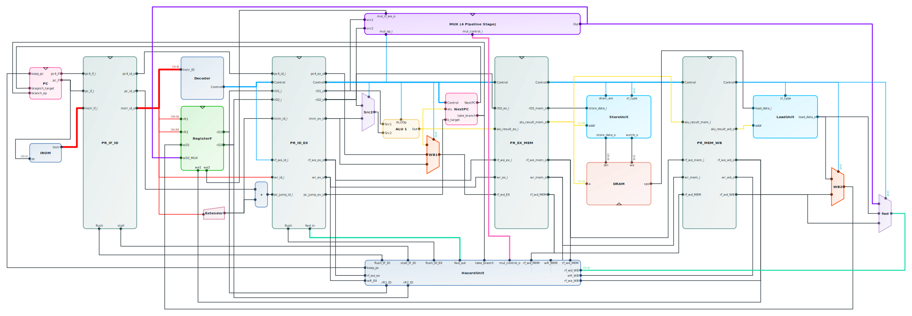

# CoreCat - 轻松绘制模块图

  

  
  
  
  

CoreCat 是一个轻量的浏览器端模块/连线绘制工具，用于快速绘制模块级电路图，支持可视化编辑模块、端口、连线，并导入导出。

## 示例

 - 源代码：[Escute-RV](https://github.com/Zxis233/EsCute-RV/tree/Zmmul)
 - JSON格式：[rscuterv.json](examples/escuterv.json)

## 主要功能
 - [x] 模块拖拽与自定义颜色
 - [x] 自由连线与交点标注
 - [x] 组合与时序逻辑模块、钟控寄存器、多路复用器
 - [x] 导入与导出（JSON/SVG/PNG）
 - [x] 常用快捷键（复制粘贴/撤销重做/垂直拖动）
 - [x] 彩蛋 